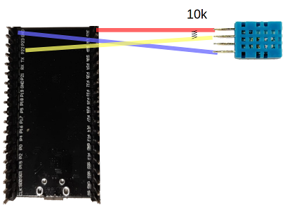
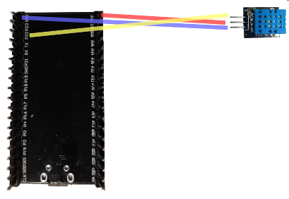
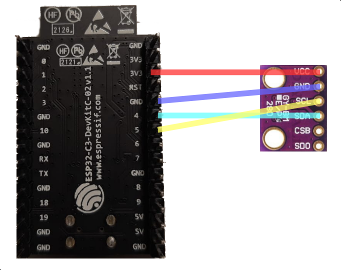

# CEIOT BASE

Código para ejemplo básico de IoT

Lo siguiente se puede hacer en cualquier sistema de virtualización por comodidad y prolijidad o directamente en una máquina real.

## Paso 1: VM con virtualbox

  - CPUs    : 1
  - Memoria : 4 GB 
  - Disco   : 40 GB (llega a ocupar casi 20GB)
  - Network : bridge
  - Distro  : Ubuntu Server 20.04.4 LTS
  - System -> processor -> enable pae/nx

Finalizado el proceso de instalación, quizás con 2GB o incluso 1.5 GB de RAM alcance sin firefox.

### En el anfitrión

    # En una terminal
    sudo addgroup "$USER" vboxuser
    sudo addgroup "$USER" dialout
    # logout/login

### Instalación

    # Bajar el instalador de https://ubuntu.com/download/server.
    # option 2: manual server installation
    # alternative downloads
    # get Ubuntu Server 20.04 LTS
    # Crear una nueva VM.
    # Parametrizar según los valores previos
    # Al arrancar, va a preguntar de dónde, darle la ruta a la ISO descargada.
    # language -> english -> done
    # installer update available -> update to the new installer
    # keyboard configuration -> el que te guste -> done
    # network connections -> (debe conectarse a algo) -> done
    # Configure proxy -> solo si corresponde -> done
    # Configure Ubuntu archive mirror -> done
    # guided storage configuration -> use entire disk -> done
    # storage configuration -> done
    # confirm destructive action -> continue
    # your name: iot
    # your server's name: iot
    # pick a username : iot
    # choose a password: el que te guste
    # confirm your password: 
    # done
    # ssh setup -> install openssh server -> done
    # featured server snaps -> ninguno -> done
    # Install complete! -> paciencia, no apretar "Cancel update and reboot"
    # downloading and installing security updates -> paciencia
    # install complete -> reboot now
    # Please remove the intallation medium, then press ENTER -> enter
 
    
    
### Ajustes

    # Apretar enter, debe aparecer
    # iot@iot:~$
    # hacer login
    sudo apt install xorg openbox firefox git gcc make perl 
    # En el menú de VirtualBox asociado a la instancia actual
    # Devices -> Insert guest additions CD image...
    sudo mount /dev/cdrom /mnt
    sudo /mnt/VBoxLinuxAdditions.run
    # paciencia...
    # En una terminal
    sudo addgroup "$USER" dialout
    sudo reboot

### Espacio libre

Por algún motivo que ignoro, la instalación no usa todo el espacio disponible, se corrige en cualquier momento con:

      $ sudo lvextend -l +100%FREE /dev/mapper/ubuntu--vg-ubuntu--lv
      $ sudo resize2fs /dev/mapper/ubuntu--vg-ubuntu--lv

## Paso 2: Fork del proyecto

### Generación SSH keys

     # En una terminal
     ssh-keygen -t ed25519 -C "your_email@example.com"
     # enter, enter, enter...
     # copiar al portapapeles el contenido de .ssh/id_ed25519.pub

     # En la interfaz web de github
     # Setting
     # SSH and GPG keys
     # New SSH key
     # Definir un título y pegar el contenido del portapapeles
     # Tomado de https://docs.github.com/articles/generating-an-ssh-key/
   
### Código referencia

     # hacer fork del proyecto https://github.com/cpantel/ceiot_base.git a tu repo
     mkdir ~/esp
     cd ~/esp    
     git clone git@github.com:xxxx/ceiot_base.git

### Prueba

     git checkout (preguntar al docente)
     # agregar al final de README.md "tocado por XXXXX"
     git status ; # para ver que archivos cambiaron
     git diff   ; # para ver los cambios
     git add README.md
     git commit -m "prueba"
     git push

## Paso 3: API/SPA

### Instalación node + typescript

    curl -sL https://deb.nodesource.com/setup_17.x | sudo -E bash -
    # va a tirar un warning por deprecated, no importa, esperar 20 segundos
    sudo apt install nodejs
    node --version
    #Debe ser 17.x.x, en caso contrario el paso con curl falló
    sudo npm install typescript -g

### Instalación dependencias del proyecto

    cd ~/esp/ceiot_base/api
    npm install; # express body-parser mongodb-memory-server mongodb pg-mem

### Pruebas

En una terminal servidor API:

    cd ~/esp/ceiot_base/api
    node index.js
    
Esperamos:

    mongo measurement database Up
    sql device database up
    Listening at 8080

En otra terminal, servidor SPA:

    cd ~/esp/ceiot_base/api/spa
    ./rebuild.sh
    
Esperamos:

    Starting compilation in watch mode...
    Found 0 errors. Watching for file changes.
    
Cliente, en otra terminal:

    cd ~/esp/ceiot_base/tools
    ./get_color_device.sh 00
    
Esperamos (observar que la invocación no es exactamente la misma, lo que importa es el resultado):
    

En un navegador, probar las siguientes URLs:

    SPA: http://localhost:8080/index.html -> lista de dispositivos con un botón de refrescar

    
    WEB: http://localhost:8080/web/device -> lista de dispositivos web
    

    
    API: http://localhost:8080/device -> lista dispositivos JSON

## Paso 4: Entorno ESP-IDF para ESP32/ESP32s2/ESP32c3

En el último paso, alcanza con elegir sólo las que uno tiene.

    sudo apt install git wget flex bison gperf python3 python3-pip python3-setuptools cmake ninja-build ccache libffi-dev libssl-dev dfu-util libusb-1.0-0 
    cd ~/esp
    git clone https://github.com/UncleRus/esp-idf-lib.git
    git clone -b v4.4 --recursive https://github.com/espressif/esp-idf.git
    cd ~/esp/esp-idf-lib
    git checkout 0.8.2
    cd ~/esp/esp-idf
    git checkout release/v4.4
    git submodule update --init --recursive
    # según tengas esp32, esp32c3 o esp32s2:
    ./install.sh esp32
    ./install.sh esp32c3
    ./install.sh esp32s2
    # pueden ir juntos en una sola línea, sin espacios, por ejemplo:
    ./install.sh esp32,esp32c3,esp32s2

Relato informal de la experiencia de exploración:

[Ejemplo de ESP32 con lectura de DHT11](https://seguridad-agile.blogspot.com/2022/02/ejemplo-de-esp32-con-lectura-de-dht11.html)

[Primer contacto con ESP32](https://seguridad-agile.blogspot.com/2022/02/primer-contacto-con-esp32.html)

### Conexión del microcontrolador

    # En el menú de VirtualBox asociado a la instancia actual
    # Devices -> USB
    # Elegir el similar a:
    # Silicon Labs CP2102 USB to UART Bridge Controller

Para comprobar, ejecutar:

    dmesg | tail -20

Esperamos algo parecido a:

    ....
    [291935.428251] usb 2-2: new full-speed USB device number 8 using ohci-pci
    [291935.783414] usb 2-2: New USB device found, idVendor=10c4, idProduct=ea60, bcdDevice= 1.00
    [291935.783419] usb 2-2: New USB device strings: Mfr=1, Product=2, SerialNumber=3
    [291935.783422] usb 2-2: Product: CP2102 USB to UART Bridge Controller
    [291935.783425] usb 2-2: Manufacturer: Silicon Labs
    [291935.783427] usb 2-2: SerialNumber: 0001
    [291935.797316] cp210x 2-2:1.0: cp210x converter detected
    [291935.817665] usb 2-2: cp210x converter now attached to ttyUSB0

Ejecutar:

    ls -l /dev/ttyUSB*
    
Esperamos algo parecido a:

    crw-rw---- 1 root dialout 188, 0 May 17 23:43 /dev/ttyUSB0

### Build y Flash 

Es conveniente comenzar con ESP32c3. 

Dado un microcontrolador **MICRO** entre *esp32*, *esp32c3* y *esp32s2* y un sensor **SENSOR** entre *bmp280* y *dht11*:

    # Para habilitar la toolchain
    cd ~/esp/esp-idf
    . ./export.sh
    # Ir a la carpeta del objetivo deseado
    cd ~/esp/ceiot_base/${MICRO}-${SENSOR}
    cp ../config/config.h.template config.h
    # modificar en config.h 
    #  dirección del servidor
    #    API_IP
    #    API_PORT
    #  credenciales de WiFi
    #    CONFIG_EXAMPLE_WIFI_SSID
    #    CONFIG_EXAMPLE_WIFI_PASSWORD
    #  identificador del dispositivo
    #    DEVICE_ID
    #  user agent del dispositivo
    #    USER_AGENT
    #  si SENSOR es dht11
    #    ONE_WIRE_GPIO
    #  si SENSOR es bmp280
    #    SDA_GPIO
    #    SCL_GPIO
    idf.py set-target ${MICRO}
    ../set-wifi.sh
    idf.py build
    idf.py flash
    idf.py monitor

### Microcontrolador ESP32

Dependiendo del modelo, puede hacer falta oprimir los botones para el paso **flash**:

#### Receta 1 (comprobada por docente)

    $ idf.py flash
    Executing action: flash
    Serial port /dev/ttyUSB0
    Connecting...........**RESET**
    Detecting chip type... Unsupported detection protocol, switching and trying again...
    Connecting....
    Detecting chip type... ESP32
    ...
    esptool.py v3.3-dev
    Serial port /dev/ttyUSB0
    Connecting...............**RESET**
    Chip is ESP32-D0WDQ6 (revision 1)
    Features: WiFi, BT, Dual Core, 240MHz, VRef calibration in efuse, Coding Scheme None
    ...

#### Receta 2 (tomada de https://youtu.be/Jt6ZDct4bZk?t=912, al docente no le funcionó)

    apretar y mantener **RESET** 
    apretar y soltar **BOOT**
    soltar **RESET**
    $ idf.py flash

#### Monitor

    $ idf.py monitor
    Executing action: monitor
    Serial port /dev/ttyUSB0
    Connecting........... **RESET**
    Detecting chip type... Unsupported detection protocol, switching and trying again...
    Connecting....
    ...
    --- idf_monitor on /dev/ttyUSB0 115200 ---
    ...
   

## Anexo 1: Conexión del sensor

### Microcontrolador ESP32 con sensor DHT11

### Microcontrolador ESP32 con sensor BMP280

### Microcontrolador ESP32c3 con sensor BMP280

### Microcontrolador ESP32s2 con sensor DHT11 ⌛

### Microcontrolador ESP32s2 con sensor BMP280 ⏳

### Microcontrolador ESP8266 con sensor DHT11 ⏳

## Anexo 2: (opcional) Alias útiles para git

     git config --global alias.lol "log --graph --decorate --pretty=oneline --abbrev-commit"
     git config --global alias.lola "log --graph --decorate --pretty=oneline --abbrev-commit --all"
     git config --global alias.lolg "log --graph --decorate --pretty=format:'%Cgreen %ci %Cblue %h %Cred %d %Creset %s'"

## Anexo 3: (opcional) Entorno ArduinoIDE

### Microcontrolador ESP8266 con sensor DHT11

Instalación y configuración Arduino IDE

     # Descargar de https://www.arduino.cc/en/software
     cd ~/esp
     tar -xf ../Downloads/arduino-x.x.xx-linux64.tar.xz
     ./arduino-x.x.xx/arduino
     # File -> preferences -> Additional Boars Manager URLs
     # http://arduino.esp8266.com/stable/package_esp8266com_index.json
     # Tools -> Board -> Board Manager -> search esp8266 -> esp8266 by ESP8266 Community -> install
     # Tools -> Board ->ESP8266 Generic Module
     # Tools -> Manage Libraries -> search dht sensor -> DHT sensor library for ESPx -> install

Build y flash del proyecto

     # cd ~/esp/ceiot_base
     # cp config/config.h.template esp8266-dht11-arduino/config.h
     # Conectar device
     # Abrir arduinoIDE
     # Tools -> Port -> /dev/ttyUSB0
     # File -> Open -> ~/esp/ceiot_base/esp8266-dht11-arduino/esp8266-dht11-arduino.ino
     # Sketch -> Upload

[Más detalles en el Plan B](https://seguridad-agile.blogspot.com/2022/03/ejemplo-de-esp8266-con-lectura-de-dht11planB.html)

### Entorno ESP8266_RTOS_SDK para ESP8266

Este entorno no me funcionó y además rompió el de ESP-IDF.

[Ejemplo de ESP8266 con lectura de DHT11](https://seguridad-agile.blogspot.com/2022/03/ejemplo-de-esp8266-con-lectura-de-dht11.html)

## TODO

Cambios a aplicar tras terminar los alumnos con el paso 3.

### Persistencia

Que el sistema implemente un endpoint que active guardar en un archivo lo que haya en las bases y al reiniciar que restaure. O implementar en tools mecanismos explícitos.

### Copias locales

Para evitar dependencia con conexión a Internet

En index.js: https://github.com/obadakhalili/Sprightly/blob/main/index.js
En spa/index.html:      <link href="https://fonts.googleapis.com/icon?family=Material+Icons" rel="stylesheet">

### Content-Length &#10004;

Deshardcodear

### Nombre proyecto &#10004;

Camibar CMakeLists.txt:project(http_request) -> (algo mejor)

### Ubicación config.h &#10004;

En los main.c hay una referencia a un archivo que no puede alcanzar por rutas relativas.

#include "/home/iot/esp/ceiot_base/config/config.h"   // esto es mejorable...

Lo mejor sería cambiarle el nombre a set-wifi.sh y que además copie config/config.h a la carpeta del dispositivo.

### Contenido config.h &#10004;

Sería conveniente quitar de main.c cualquier elemento variable para no afectar el versionado. Habría que llevar a config.h DEVICE_ID, ONE_WIRE_GPIO, SDA_GPIO, SCL_GPIO :

### DHT11 explícito &#10004;

Renombrar esp32 a esp32-dht11 

